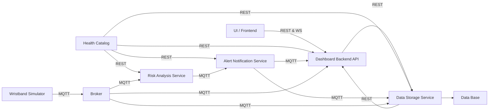
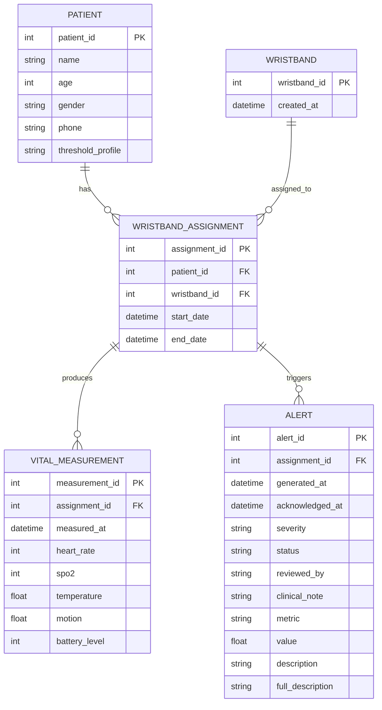

IoT Platform for Smart Health Monitoring (Course Project)
#  IoT Health Monitoring Platform

A modular, scalable **IoT-based health monitoring system** for real-time patient vitals tracking, alert management, and clinical dashboards.

---

##  Overview

This project implements a **distributed microservice architecture** designed to monitor patients using wearable wristbands.  
It supports real-time vital collection, alert lifecycle management, and UI-ready dashboards.

The system is composed of **three main layers**:

- **UI (Frontend)** – Clinician dashboard
- **Dashboard Backend API** – UI-oriented orchestration
- **Data Storage Service** – Database & domain logic

---

##  High-Level Architecture

## 📌 Design Principle

Dashboard Backend never accesses the database directly.  
All persistence and domain logic live exclusively in Data Storage.

---

## 🧱 Services Description

### 1️⃣ UI (Frontend)

Consumes REST APIs from Dashboard Backend.

Displays:

- Patients & details  
- Live vitals  
- Alerts & acknowledgments  
- Wristband management  

---

### 2️⃣ Dashboard Backend (FastAPI)

**Role:** UI-oriented orchestration layer

**Responsibilities:**

- Aggregate data into UI-ready structures  
- Transform domain data → presentation models  
- Handle endpoints:
  - `/dashboard/overview`
  - `/patients`
  - `/vitals`
  - `/alerts`
  - `/wristbands`

**Does NOT:**

- Store data  
- Run SQL  
- Generate timestamps for persistence  

---

### 3️⃣ Data Storage Service (FastAPI + SQLAlchemy)

**Role:** Single source of truth

**Responsibilities:**

- Database access & transactions  
- Domain consistency  
- Alert lifecycle management  
- Assignment integrity  

**Generates internally:**

- `created_at`  
- `generated_at`  
- `acknowledged_at`  
- `start_date` / `end_date`  

---

## 🗄️ Database Schema (ERD)

##  Key Design Decisions

- Strict service boundaries  
- No shared database access  
- UI schemas isolated from DB schemas  
- All timestamps generated server-side  
- Assignments guarantee medical correctness  
- REST-first architecture  

---

##  Tech Stack

- **FastAPI** – REST APIs  
- **SQLAlchemy** – ORM  
- **PostgreSQL / SQLite**  
- **MQTT** – IoT ingestion  
- **Docker & Docker Compose**  
- **Pydantic** – Validation  
- **Uvicorn** – ASGI server  

---

##  Features

- Patient management  
- Wristband assignment & unassignment  
- Real-time vitals ingestion  
- Alerts lifecycle & acknowledgment  
- Dashboard overview & stats  
- Low battery detection  
- Clean microservice architecture  
